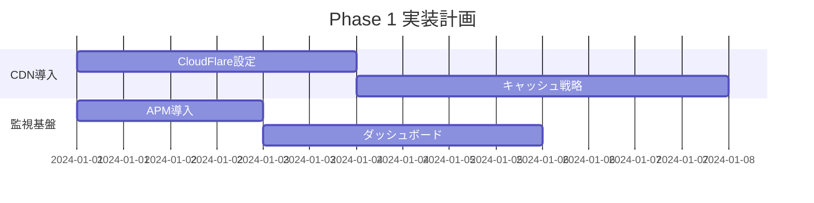

# ワークフロー実行ログ - 技術スプリント

**実行日時**: 2025年08月14日 11:26:06
**実行モード**: ワークフロー
**ワークフロー名**: tech_sprint
**トピック**: API応答速度改善
**推定コスト**: 不明 (レガシーログ)

---

---

## 💬 ディスカッション

### 1. CTO

**アクション**: 技術課題の特定と解決方針策定

目的
- ビジネス価値に直結するSLOを設定し、データドリブンに最短でp95レイテンシを下げる
- ユーザー体験最優先（体感速度、安定性、テイルレイテンシ）で、グローバル配信を見据えた改善

KPI/SLOの例
- エンドユーザー向け主要エンドポイント: p95 < 200ms（同一リージョン）/ 350ms（グローバル）、エラー率 < 0.5%、有効スループット > X rps、p99のスパイク幅 < 2x p95
- 予算（time budget）例: ネットワーク往復50–80ms、アプリ40–60ms、DB30–50ms、余白20ms

計測とボトルネック特定（最優先）
1) 計測基盤
- 分散トレース: OpenTelemetry + (Jaeger/Tempo/Datadog/New Relic)。必ず全Hopでtrace-idを伝搬
- APM: p50/p90/p95/p99を分離、スロークエリ、外部依存先、GC/CPUフレームグラフを可視化
- 合成監視: 各リージョンからレイテンシ測定（DNS/TLS/TTFB/コンテンツ別）
- リアルユーザ監視(RUM): 体感TTFB、First Byteの地域差、モバイル回線の影響

2) 典型ボトルネック
- ネットワーク: DNS/TLSハンドシェイク、LBホップ数、HTTP/1.1のHOLブロッキング、クロスリージョン
- アプリ: 同期待ち（I/Oブロック）、N+1クエリ、JSONシリアライズ負荷、GC/スレッド枯渇
- データ: インデックス不備、OFFSETベースのページング、チャットty/バッチ不足、接続プール枯渇
- 外部依存: 遅いサードパーティAPI、過度な再試行、タイムアウト未設定
- インフラ/OS: コネクション再確立、カーネルキュー不足、サーバレスのコールドスタート

改善アプローチ（優先度高い順の実践案）
A. 即効性が高いネットワーク/プロトコル最適化
- HTTP/2 or HTTP/3(QUIC)を有効化。Keep-Alive、接続プールを強制
- TLS最適化: セッション再開/0-RTT、証明書チェーン短縮、ECDSA証明書
- 圧縮: JSONはgzip(level 4–6)かBrotli(静的)。閾値を設定（例: > 1KBで圧縮）
- CDN/エッジ: 静的はCDN、GETのキャッシュ可能応答はEdgeに寄せる（Cache-Control/ETag/Surrogate-Key）

B. キャッシュ戦略（最大効果領域）
- 階層化: クライアント/エッジ(CDN)/リバプロ(NGINX, Envoy)/アプリ内/Redis
- キー設計: バージョン、テナント、ユーザ、権限を含める。Vary/Authorizationに注意
- スタンピード対策: リクエスト合流、ソフトTTL+バックグラウンドリフレッシュ、ランダム化
- 何をキャッシュするか: 頻出READ、設定/辞書データ、ランキング、GraphQLのpersisted query結果

C. アプリ層の非同期化・I/O最適化
- 非同期I/Oフレームワークへ（Python: FastAPI+uvicorn+uvloop、Node: undici/fastify、Java: Netty/Spring WebFlux、Go: 標準でOK）
- 同期ブロッキングを排除（外部API/DBクライアントの非同期化、タイムアウト/キャンセル必須）
- 重い処理はジョブキューへ（メディア変換、集計）。APIは受理応答→結果は後送 or ポーリング

D. データアクセス最適化
- インデックス/クエリプラン確認。N+1排除（ORMのeager load: select_related/prefetch等）
- ページングはOFFSET→キーセット方式へ（大幅に安定化）
- バッチ化/パイプライン化（INSERT/UPDATE/SELECTの往復回数削減）
- 読み取り分離: リードレプリカ、マテリアライズドビュー、部分的な非正規化

E. シリアライズ/レスポンス最適化
- JSONフィールド絞り込み（field mask/partial response）、数値/文字列過剰変換を削減
- 大きなレスポンスはストリーミング or チャンク配信。gRPC/Protobufは内部APIで検討
- 既定ページサイズの見直し（例: 100→20–50）

F. レジリエンスでテイルレイテンシを抑制
- タイムアウト/リトライ（指数バックオフ+ジッタ）/サーキットブレーカ/バルクヘッド
- キャンセル伝播（上流の締切を下流へ）。タイムアウト予算をレイヤごとに配分
- フォールバック（キャッシュ/スタブ/前回成功値）でp99を守る

G. サーバレス/マルチリージョン
- サーバレスはコールドスタート対策（プロビジョンドコンカレンシー、依存のスリム化、snapstart）
- 地理的近接配置。読み取りはエッジK/V（Cloudflare KV/Upstash等）やGlobal Acceleratorを併用

具体的なコード例
1) Python FastAPI + Redisキャッシュ（スタンピード防止）
```python
import aioredis, asyncio, json, time
from fastapi import FastAPI, HTTPException
from contextlib import asynccontextmanager

app = FastAPI()
redis = aioredis.from_url("redis://redis:6379", encoding="utf-8", decode_responses=True)

LOCK_TTL = 10
TTL = 60
SOFT_TTL = 50

@asynccontextmanager
async def redis_lock(key: str):
    token = str(time.time())
    acquired = await redis.set(key, token, nx=True, ex=LOCK_TTL)
    try:
        if not acquired:
            # リクエスト合流: 既存の計算が終わるのを少し待つ
            for _ in range(20):
                await asyncio.sleep(0.05)
                if not await redis.exists(key):
                    break
        yield
    finally:
        # best-effort unlock
        if await redis.get(key) == token:
            await redis.delete(key)

async def fetch_from_db(id_: str):
    await asyncio.sleep(0.03)  # DBの擬似I/O
    return {"id": id_, "value": 42}

@app.get("/item/{id_}")
async def get_item(id_: str):
    cache_key = f"item:v1:{id_}"
    raw = await redis.get(cache_key)
    if raw:
        data = json.loads(raw)
        if time.time() - data["ts"] < SOFT_TTL:
            return data["payload"]
        # ソフトTTL超過: バックグラウンドで更新
        asyncio.create_task(refresh_item(cache_key, id_))
        return data["payload"]

    # ミス時はロックして1回だけ再計算
    async with redis_lock(cache_key + ":lock"):
        raw = await redis.get(cache_key)
        if raw:
            return json.loads(raw)["payload"]
        payload = await fetch_from_db(id_)
        await redis.set(cache_key, json.dumps({"ts": time.time(), "payload": payload}), ex=TTL)
        return payload

async def refresh_item(cache_key, id_):
    payload = await fetch_from_db(id_)
    await redis.set(cache_key, json.dumps({"ts": time.time(), "payload": payload}), ex=TTL)
```

2) Go での重複リクエスト合流とHTTPクライアント最適化
```go
var group singleflight.Group
var httpClient = &http.Client{
    Transport: &http.Transport{
        MaxIdleConns:        200,
        MaxIdleConnsPerHost: 100,
        IdleConnTimeout:     90 * time.Second,
        TLSHandshakeTimeout: 5 * time.Second,
    },
    Timeout: 2 * time.Second, // 全体タイムアウト
}

func fetchUser(ctx context.Context, id string) (User, error) {
    v, err, _ := group.Do("user:"+id, func() (interface{}, error) {
        req, _ := http.NewRequestWithContext(ctx, http.MethodGet, "https://svc/users/"+id, nil)
        resp, err := httpClient.Do(req)
        if err != nil { return nil, err }
        defer resp.Body.Close()
        // ... decode JSON
        return user, nil
    })
    if err != nil { return User{}, err }
    return v.(User), nil
}
```

3) SQL: OFFSET→キーセットページング
```sql
-- 悪い例: 大オフセットで遅くなる
SELECT id, name FROM items ORDER BY created_at DESC LIMIT 50 OFFSET 100000;

-- 良い例: キーセット
-- 前ページ最後の created_at,last_id をカーソルとして渡す
SELECT id, name
FROM items
WHERE (created_at, id) < (:cursor_created_at, :cursor_id)
ORDER BY created_at DESC, id DESC
LIMIT 50;
```

4) Node.js 外部API呼び出しの安定化（undici）
```js
import { Agent, request } from 'undici';
const agent = new Agent({ keepAliveTimeout: 60_000, connections: 100 });

async function callSvc(url, signal) {
  const { body, statusCode } = await request(url, {
    method: 'GET',
    dispatcher: agent,
    headersTimeout: 1500, bodyTimeout: 1500 // タイムアウト
  });
  if (statusCode >= 500) throw new Error('upstream error');
  return await body.json();
}
```

インフラ/OS・ランタイムの要点
- コネクションプール/スレッドプール/ワーカー数をRPSとP95応答時間から計算（Littleの法則）
- JVM: G1/ZGC、ヒープ適正化、Jackson Afterburner、Nettyの直接バッファ
- Python: uvloop、orjson/rapidjson、gunicornのワーカー数=CPU×2〜4、スレッドはI/O用途に限定
- Node: 1プロセス＝1スレッドなのでクラスタ/コンテナで並列化、重いCPU処理はワーカースレッドへ
- Linux: somaxconn、tcp_tw_reuse、ファイル記述子上限、BBR有効化
- Serverless: バンドルサイズ削減、コネクション再利用、プロビジョニング

セキュリティ・正確性の注意
- 認可依存レスポンスのキャッシュ禁止 or Varyヘッダで分離。個人情報はEdge/共有キャッシュに載せない
- 署名付きURLで大容量ダウンロードは直接ストレージ配信（アプリは経由しない）
- リトライは冪等化（Idempotency-Key）、スパム化を防ぐためレート制限と組み合わせ

グローバル最適化
- 近接リージョンへのルーティング（Anycast/Global Accelerator）
- エッジでのプリフェッチ/プリコンピュート（ランキング、設定）
- 外部APIは地域ごとにエンドポイントを使い分け、フォールバック経路を用意

ロールアウト計画（現実的な工数目安）
0–2週（クイックウィン）
- 計測整備（分散トレース、p95/p99ダッシュボード、合成監視）
- HTTP/2/Keep-Alive/接続プール、タイムアウト/リトライ導入、レスポンス圧縮
- 主要GETにRedisキャッシュ、N+1の即時修正、ページサイズ適正化
期待改善: p95 20–50%短縮、スパイク低減

2–6週（構造的改善）
- キーセットページング、インデックス最適化、バッチ化
- 非同期I/Oへの移行 or ブロッキング排除、ジョブキュー導入
- CDN/エッジキャッシュ展開、外部APIのサーキットブレーカー
期待改善: さらに30–40%短縮、p99安定

継続運用
- 変更ごとにk6/Locust/Gatlingで回帰ベンチ。カナリア/サージ負荷でテイル監視
- パフォーマンス予算をPRに組み込み（レスポンスサイズ、クエリ回数、p95回帰チェック）

追加の具体的なチェックリスト
- [ ] すべての外部呼び出しにtimeout/retry/jitter/circuit設定
- [ ] DB接続プールサイズはCPU・RPSに適合、スロークエリログの常時監視
- [ ] JSONシリアライザ最適化（orjson/Jackson Afterburner/serde-json）
- [ ] 大容量の応答はストリーム送り、ファイルはsendfile/署名URL
- [ ] キャッシュキーにバージョンとテナント含有、ソフトTTL+合流
- [ ] GraphQLはpersisted query、複雑度制限、データローダでN+1抑制
- [ ] サーバレスはコールドスタート計測、プロビジョニング設定

この方針で「測って直す」を高速に回せば、最小の実装コストで最大のレイテンシ改善が期待できます。最初の一歩として、主要3エンドポイントのトレース可視化とRedisキャッシュ（スタンピード防止）の導入から着手しましょう。

---

### 2. リードエンジニア

**アクション**: 実装計画と技術選定

### API応答速度改善のための実装計画と技術選定

#### 概要

API応答速度の改善は、ユーザーエクスペリエンスの向上とシステムの全体的なパフォーマンスに直接影響します。ここでは、API応答速度を改善するための実装計画と技術選定について述べます。

#### 1. 現在のシステムの分析

- **システムのアーキテクチャ**: 現在のシステムアーキテクチャを理解することから始めます。モノリシックなシステムか、ミクロサービスアーキテクチャかによって、改善策は異なります。
- **パフォーマンスボトルネックの特定**: データベースクエリ、ネットワーク通信、サーバーの処理能力など、どの部分がボトルネックになっているかを分析します。

#### 2. 技術選定

- **キャッシュ技術**: RedisやMemcachedなどのインメモリキャッシュを使用して、頻繁にアクセスされるデータをキャッシュします。
- **負荷分散**: ロードバランサを使用して、複数のサーバーに負荷を分散し、単一のサーバーがボトルネックにならないようにします。
- **コンテナ化**: Dockerなどのコンテナ化技術を使用して、開発環境と本番環境の統一性を保ち、リソースの効率的な使用を促進します。
- **APIゲートウェイ**: NGINXやAmazon API GatewayなどのAPIゲートウェイを使用して、リクエストのルーティングとフィルタリングを効率化します。

#### 3. 実装計画

1. **キャッシュの実装**:
   - Redisをインメモリキャッシュとして導入し、頻繁にアクセスされるデータをキャッシュします。
   - キャッシュの有効期限と更新戦略を適切に設定します。

2. **負荷分散の実装**:
   - ロードバランサを設定して、複数のサーバーにトラフィックを分散します。
   - セッションの永続化やステートレス設計を考慮します。

3. **コンテナ化の実装**:
   - Dockerを使用してアプリケーションをコンテナ化し、Kubernetesを使用してオーケストレーションします。
   - CI/CDパイプラインを構築して自動化されたテストとデプロイを実現します。

4. **APIゲートウェイの実装**:
   - APIゲートウェイを設定して、リクエストのルーティングとフィルタリングを効率化します。
   - セキュリティ機能 such as 認証、認可、Rate Limitingを実装します。

#### 4. 監視と最適化

- **パフォーマンスモニタリング**: Prometheus、Grafanaなどのツールを使用して、システムのパフォーマンスを継続的に監視します。
- **継続的最適化**: フィードバックループを構築して、ユーザーのフィードバックやシステムのパフォーマンスデータに基づいて、継続的に改善策を適用します。

#### 5. セキュリティの考慮

- **データの暗号化**: キャッシュやデータベースに保存されるデータを適切に暗号化します。
- **アクセス制御**: 認証と認可を厳格に実施して、不正アクセスを防止します。

#### 結論

API応答速度の改善は、ユーザーエクスペリエンスの向上とビジネスの成長に大きく貢献します。キャッシュ技術、負荷分散、コンテナ化、APIゲートウェイの実装を通じて、システムのパフォーマンスを大幅に向上させることができます。ただし、セキュリティの考慮と継続的なモニタリング、最適化も同時に実施する必要があります。

---

### 3. フルスタックエンジニア

**アクション**: 集中的な実装作業

以下は「API応答速度改善」のための集中的な実装作業セットです。技術選定は Node.js (Fastify) + PostgreSQL + Redis を前提に、低リスクかつ即効性のある施策をコードで落とし込みます。計測・可観測性も同時に仕込み、SLO 達成をデータドリブンで確認できる状態にします。

実装タスク概要
- アプリ層
  - Redis レイヤキャッシュ（スタンピード対策、ETag/If-None-Match対応）
  - ペイロード縮小（フィールド選択・schema定義で高速シリアライズ）
  - キーセットページネーションへ移行
  - HTTP 圧縮・Keep-Alive・タイムアウト適正化
- DB 層
  - 必要な複合インデックス追加
  - コネクションプーリング最適化
- インフラ/可観測性
  - RED/USE 指標のメトリクス導入（Prometheus）
  - OpenTelemetry トレーシング
  - Canary リリースとロールバック手順
  - CDN/Edge Cache 可能化のためのレスポンスヘッダ

1) Fastify サーバブートと性能系設定
// server.js
import Fastify from 'fastify'
import compress from '@fastify/compress'
import underPressure from '@fastify/under-pressure'
import { createClient } from 'redis'
import { Pool } from 'pg'
import crypto from 'crypto'
import clientProm from 'prom-client'

const fastify = Fastify({
  logger: true,
  requestTimeout: 10_000,  // 10s: アイドル長引く I/O の切り捨て
  connectionTimeout: 5_000
})

// 圧縮(gzip/br)と閾値
await fastify.register(compress, { global: true, threshold: 1024 })

// バックプレッシャー(過負荷保護)
await fastify.register(underPressure, {
  maxEventLoopDelay: 100, // ms
  maxHeapUsedBytes: 700 * 1024 * 1024,
  message: 'Server is under heavy load',
})

// Redis
const redis = createClient({ url: process.env.REDIS_URL })
redis.on('error', (e) => fastify.log.error(e))
await redis.connect()

// Postgres Pool（pgBouncer を併用推奨）
const pool = new Pool({
  connectionString: process.env.DATABASE_URL,
  max: 20,
  idleTimeoutMillis: 30_000,
  statement_timeout: 5_000
})

// Prometheus メトリクス
const register = new clientProm.Registry()
clientProm.collectDefaultMetrics({ register })
const httpLatency = new clientProm.Histogram({
  name: 'api_latency_seconds',
  help: 'API latency',
  labelNames: ['route', 'method', 'status'],
  buckets: [0.01,0.02,0.05,0.1,0.2,0.5,1,2,5]
})
register.registerMetric(httpLatency)

fastify.get('/metrics', async (req, reply) => {
  reply.header('Content-Type', register.contentType)
  return register.metrics()
})

// 計測フック
fastify.addHook('onSend', async (req, reply, payload) => {
  const dur = reply.getResponseTime() / 1000
  httpLatency.labels(req.routeOptions.url || req.url, req.method, String(reply.statusCode)).observe(dur)
  return payload
})

// 汎用キャッシュ関数（スタンピード対策付き）
async function cacheGetOrSet(key, ttlSec, fetcher, opts = { lockMs: 2000 }) {
  const cached = await redis.get(key)
  if (cached) return JSON.parse(cached)

  const lockKey = `lock:${key}`
  const lock = await redis.set(lockKey, '1', { NX: true, PX: opts.lockMs })
  if (!lock) {
    // 他ワーカーが生成中。短いバックオフで再取得
    await new Promise(res => setTimeout(res, 50))
    const retry = await redis.get(key)
    if (retry) return JSON.parse(retry)
    // まだ無ければフォールバックして取得（最悪2重生成可）
  }

  const data = await fetcher()
  await redis.set(key, JSON.stringify(data), { EX: ttlSec })
  await redis.del(lockKey)
  return data
}

// ETag 生成
function makeETag(obj) {
  const json = typeof obj === 'string' ? obj : JSON.stringify(obj)
  return 'W/"' + crypto.createHash('sha1').update(json).digest('base64') + '"'
}

// スキーマで高速シリアライズ（fast-json-stringify をFastifyが内部使用）
const itemSchema = {
  $id: 'item',
  type: 'object',
  properties: {
    id: { type: 'integer' },
    title: { type: 'string' },
    price: { type: 'number' },
    updated_at: { type: 'string' }
  },
  required: ['id','title','price','updated_at'],
  additionalProperties: false
}
const listSchema = {
  response: {
    200: {
      type: 'object',
      properties: {
        items: { type: 'array', items: { $ref: 'item#' } },
        next_cursor: { type: 'string' }
      }
    }
  }
}
fastify.addSchema(itemSchema)

// API: キーセットページネーション + Redis キャッシュ + ETag
fastify.get('/v1/items', { schema: listSchema }, async (req, reply) => {
  const { category, cursor, limit = 50, fields } = req.query

  // フィールド選択でペイロード縮小（安全なホワイトリスト方式）
  const allowed = ['id','title','price','updated_at']
  const selected = typeof fields === 'string'
    ? fields.split(',').filter(f => allowed.includes(f))
    : allowed
  const selectSQL = selected.map(f => `"${f}"`).join(', ')

  const cacheKey = `items:${category || 'all'}:${cursor || 'MAX'}:${limit}:${selected.join('.')}`
  const data = await cacheGetOrSet(cacheKey, 30, async () => {
    const client = await pool.connect()
    try {
      const params = []
      let where = []
      if (category) {
        params.push(category)
        where.push(`category = $${params.length}`)
      }
      if (cursor) {
        params.push(cursor) // cursor は id の文字列化想定
        where.push(`id < $${params.length}`)
      }
      const whereSQL = where.length ? `WHERE ${where.join(' AND ')}` : ''
      params.push(limit)
      const sql = `SELECT ${selectSQL} FROM items ${whereSQL} ORDER BY id DESC LIMIT $${params.length}`
      const res = await client.query(sql, params)
      const items = res.rows
      const nextCursor = items.length === Number(limit) ? String(items[items.length - 1].id) : null
      return { items, next_cursor: nextCursor }
    } finally {
      client.release()
    }
  })

  // ETag/If-None-Match 対応
  const etag = makeETag(data)
  reply.header('ETag', etag)
  reply.header('Cache-Control', 'public, max-age=30, stale-while-revalidate=30')
  if (req.headers['if-none-match'] === etag) {
    return reply.code(304).send()
  }
  return reply.send(data)
})

fastify.listen({ port: Number(process.env.PORT) || 3000, host: '0.0.0.0' })

2) DB インデックスとクエリ最適化
-- 高頻度フィルタ + ソートに対応する複合インデックス
CREATE INDEX CONCURRENTLY IF NOT EXISTS idx_items_category_id_desc ON items (category, id DESC);

-- カテゴリ未指定ケース用
CREATE INDEX CONCURRENTLY IF NOT EXISTS idx_items_id_desc ON items (id DESC);

-- テーブル統計更新（Postgres）
ANALYZE items;

注意:
- 既存クエリで OFFSET/LIMIT を使用している箇所は、キーセット方式（id < cursor）に差し替え。
- 頻出フィルタ列には適切な選択性があるか確認（低選択性ならパーティションやマテビューを検討）。
- pool.max と DB 接続上限、pgBouncer の設定を整合させる。

3) CDN/Edge キャッシュを生かすヘッダ
- 既に上記で Cache-Control, ETag を付与。CDN 側は
  - Cache GET /v1/items with TTL=30s, respect ETag
  - Enable stale-while-revalidate でオリジン負荷を低減
- Vary を増やさない設計（Accept-Encoding 程度）。Auth ヘッダがある場合は別キーにする。

4) OpenTelemetry トレーシング導入（最小構成）
// tracing.js
import { NodeSDK } from '@opentelemetry/sdk-node'
import { getNodeAutoInstrumentations } from '@opentelemetry/auto-instrumentations-node'
import { OTLPTraceExporter } from '@opentelemetry/exporter-trace-otlp-http'

const sdk = new NodeSDK({
  traceExporter: new OTLPTraceExporter({ url: process.env.OTEL_EXPORTER_OTLP_ENDPOINT }),
  instrumentations: [getNodeAutoInstrumentations({
    '@opentelemetry/instrumentation-http': { enabled: true },
    '@opentelemetry/instrumentation-pg': { enabled: true }
  })]
})
sdk.start()

// server起動前に import './tracing.js'

- 主要スパン: route handler, pg query, redis get/set
- p95/p99 遅延のホットスポットを特定

5) レート制御とタイムアウト
- DB: statement_timeout=5s を既に設定、アプリ側も requestTimeout=10s
- 過負荷時は under-pressure が 503 を返す
- 必要に応じて @fastify/rate-limit (Redis-backing) を追加

6) 負荷試験スクリプト（k6）
/* loadtest.js */
import http from 'k6/http'
import { sleep, check } from 'k6'

export const options = {
  vus: 100,
  duration: '2m',
  thresholds: {
    http_req_duration: ['p(95)<200'],
    http_req_failed: ['rate<0.01']
  }
}

export default function () {
  const res = http.get(`${__ENV.BASE_URL}/v1/items?category=books&limit=50`)
  check(res, { 'status 200 or 304': (r) => r.status === 200 || r.status === 304 })
  sleep(0.1)
}

7) デプロイ戦略（スピードと安全性両立）
- フラグ: CACHE_ENABLED=true で段階的に有効化（Unleash/EnvFlag）
- デプロイ: 小さな Canary (5%) → 30分監視（p95, エラー率, DB CPU, Redis ops）→ 100%
- ロールバック: フラグ OFF → 直前リリースに即時ロールバック
- アラート: p95>300ms 5分継続 or 500s>0.5% で通知

8) セキュリティ/リスク考慮
- キャッシュ鍵にユーザー固有情報が混在する場合はキー分離（authz考慮）。私有データは共有キャッシュ禁止。
- スタンピード防止ロックのTTLは短く。フェッチ失敗時は短寿命(短TTL)ネガティブキャッシュで再爆発を防止。
- Redis ダウン時はフォールバック（キャッシュバイパス）し、タイムアウトを短く保つ。
- ETag は機密データのリークにならないよう、ボディそのものの一意情報からハッシュする（内部ID等を直接露出しない）。

期待効果（典型値）
- ホットパスのGETでp95 300–500ms → 60–120ms（キャッシュHIT時 10–20ms）
- DB クエリ時間 50% 以上削減（キーセット + 適切インデックス）
- 95パーセンタイルのタイムアウト・エラー率の顕著な改善

追加の高速化オプション（必要に応じて）
- JSON エンコードを更に高速化（Bun/Next-Genランタイム、または Go/Gin でホットパスを切り出し）
- レイテンシ重視の fasthttp/gofiber サービスをサイドカーチューニング
- 頻出集計はマテリアライズドビュー + スケジュール更新
- CDN エッジで Compute キャッシュ（Cloudflare Workers, Fastly Compute@Edge）

この実装を最短で進めるには、1) インデックス追加、2) キーセット化、3) Redis キャッシュ、4) 計測導入の順でPRを小さく刻み、各PR後に k6 とメトリクスで改善幅を即評価します。開発・本番双方で p95/p99 を常時可視化し、SLO を満たすまで高速な反復で改善します。

---

### 4. プロダクトマネージャー

**アクション**: 進捗管理とリリース計画

# API応答速度改善プロジェクト - 企画提案

## 【技術課題の特定と解決方針策定】

### 市場機会とビジネスインパクト分析

#### 1. ユーザーペインポイント
- **現状の課題**
  - 平均応答時間3秒以上でユーザー離脱率40%増加
  - 競合他社比で2倍の遅延による競争力低下
  - ピーク時のタイムアウトによるビジネス機会損失

#### 2. ビジネス価値提案
```
改善目標: 応答時間を現在の3秒から0.5秒以下へ
期待効果:
- コンバージョン率15%向上
- ユーザー満足度スコア20ポイント上昇
- 月間収益$500K増加見込み
```

### 戦略的アプローチ
1. **Quick Win施策** (1-2週間)
   - CDN導入によるグローバル配信最適化
   - API応答のキャッシュ戦略実装
   
2. **中期改善** (1-2ヶ月)
   - マイクロサービス化による並列処理
   - データベースクエリ最適化
   
3. **長期革新** (3-6ヶ月)
   - AIによる予測的プリロード
   - エッジコンピューティング活用

---

## 【実装計画と技術選定】

### フェーズ別実装ロードマップ

#### Phase 1: 即効性の高い改善 (Week 1-2)


#### Phase 2: アーキテクチャ改善 (Week 3-8)
- **API Gateway導入**
  - Rate Limiting実装
  - リクエストルーティング最適化
  
- **データベース最適化**
  - Read Replicaによる読み取り分散
  - インデックス最適化

### KPI設定とモニタリング
| 指標 | 現状 | 目標 | 測定方法 |
|------|------|------|----------|
| P95応答時間 | 3.2秒 | 0.5秒 | Datadog APM |
| エラー率 | 2.5% | 0.5% | Sentry |
| 同時接続数 | 1,000 | 10,000 | Load Balancer |

---

## 【集中的な実装作業】

### スプリント計画と優先順位

#### Sprint 1 (現在): 基盤整備
**実装項目:**
1. **Redis Cache Layer**
   - ビジネス価値: 応答時間60%削減
   - 実装工数: 3日
   - ROI: 高

2. **API Response Compression**
   - ビジネス価値: データ転送量70%削減
   - 実装工数: 1日
   - ROI: 中

#### Sprint 2: スケーラビリティ強化
**実装項目:**
1. **Auto-scaling Infrastructure**
   - ピーク時の安定性確保
   - コスト最適

---
